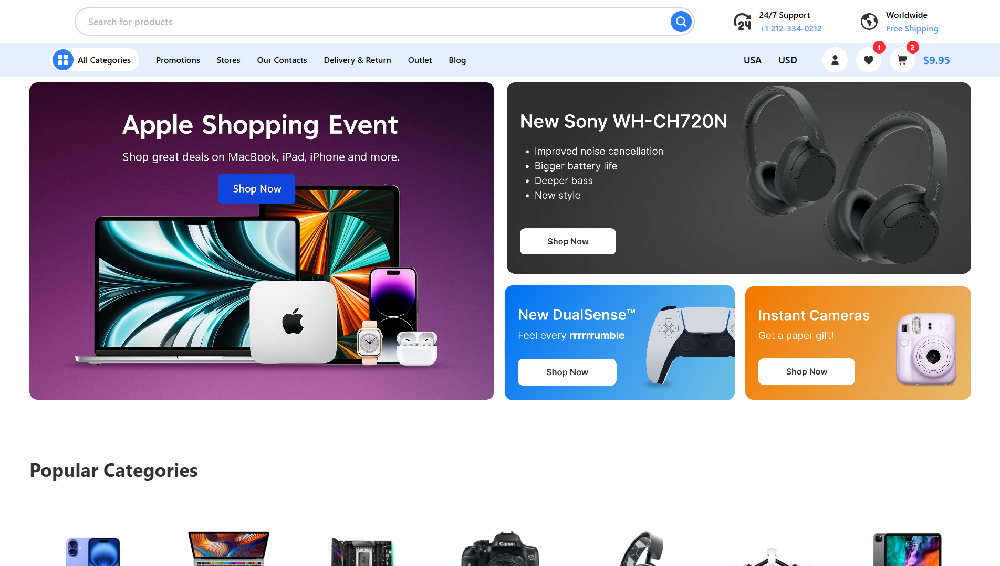

## Try it out
[🚀 Live Preview](https://tech-store-demo-one.vercel.app)

<div align="center">
  
  
  <h1>Tech Store Demo</h1>
  
  <p>
    React + TypeScript single-page demo for a tech e-commerce landing experience.<br/>
    Built with Vite, Tailwind CSS, GSAP animations, and SVGR for SVGs.
  </p>
  
  <p>
    
    
    
    
    
  </p>
</div>

## Overview

Tech Store Demo is a front-end showcase of a modern landing page for a tech e-commerce site. It demonstrates smooth scrolling, animated banners, category highlights, and a clean component structure.

- **Framework**: React 19 + TypeScript
- **Build Tool**: Vite 7
- **Styling**: Tailwind CSS v4 (via `@tailwindcss/vite`)
- **Animations**: GSAP (`ScrollSmoother`, `ScrollTrigger`)
- **SVGs**: SVGR (`vite-plugin-svgr`)
- **Linting**: ESLint

> Note: Mobile responsiveness is a work-in-progress.

## Getting Started

### Prerequisites
- Node.js 18+ (recommended)
- npm (this repo includes `package-lock.json`)

### Installation
```bash
npm install
```

### Development
Start the dev server with hot reload:
```bash
npm run dev
```
The app will be available at the URL printed in your terminal (typically `http://localhost:5173`).

### Build
Create a production build:
```bash
npm run build
```
Preview the built app locally:
```bash
npm run preview
```

### Lint
```bash
npm run lint
```

## Project Structure

```txt
.
├─ public/               # Static assets
├─ src/
│  ├─ assets/            # Local images/SVGs
│  ├─ components/        # Reusable UI components
│  ├─ sections/          # Page sections (NavBar, Main, Newsletter, Footer, etc.)
│  ├─ App.tsx            # Root app component (GSAP setup here)
│  ├─ main.tsx           # React root entry
│  └─ index.css          # Tailwind styles entry
├─ index.html            # Vite HTML entry
├─ vite.config.ts        # Vite + React + Tailwind + SVGR plugins
├─ tsconfig*.json        # TypeScript configs
└─ eslint.config.js      # ESLint configuration
```

## Key Implementation Notes

- **Tailwind CSS v4**: Integrated via `@tailwindcss/vite` plugin in `vite.config.ts`. Utilities are available out of the box—no separate Tailwind config file needed.
- **GSAP Smooth Scrolling**: `ScrollSmoother` and `ScrollTrigger` are registered and created in `src/App.tsx`, using `#scroll-wrapper` and `#scroll-content` for smooth scrolling.
- **SVGR**: Import SVGs as React components via `vite-plugin-svgr`.

## Available Scripts

From `package.json`:
```json
{
  "scripts": {
    "dev": "vite",
    "build": "tsc -b && vite build",
    "lint": "eslint .",
    "preview": "vite preview"
  }
}
```

## Deployment

This is a static SPA. After `npm run build`, the production-ready files in `dist/` can be deployed to any static host (Netlify, Vercel, GitHub Pages, etc.).

## Acknowledgements

Bootstrapped with the official Vite + React + TypeScript setup. Tailwind v4 integration via the official Vite plugin. Animations powered by GSAP.
